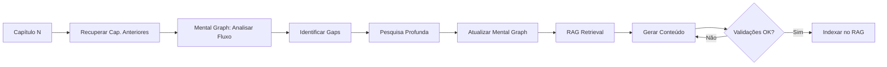

# Gerador de Ebooks Técnicos de Alta Qualidade

Sistema avançado para geração automatizada de ebooks técnicos com RAG Mental Graph, agentes de pesquisa profunda e orquestração contextual capítulo-por-capítulo.

## Features

- 🧠 **RAG Mental Graph**: Sistema de recuperação com grafo de conhecimento para manter contexto entre capítulos
- 🔍 **Pesquisa Profunda Híbrida**: Web scraping inteligente (BeautifulSoup + Playwright) + APIs acadêmicas
- 🤖 **Agentes Dinâmicos**: Criação de agentes especializados via prompt usando LangGraph
- 🎨 **UI Moderna**: Interface React/Vite com temas claro (pastéis) e escuro sofisticado
- ✅ **Anti-Alucinação**: Validação em múltiplas camadas, source tracking e confidence scoring
- 📚 **Multi-formato**: Exportação para PDF, EPUB e Markdown

## Stack Tecnológica

### Backend
- Python 3.11+ com FastAPI
- LangGraph para agentes dinâmicos
- FAISS para vector store
- Requests + BeautifulSoup4 + Playwright para scraping
- OpenRouter + Gemini APIs

### Frontend
- React 18 + Vite + TypeScript
- Lexical Editor (Meta)
- Recharts para visualizações
- CSS Modules com temas

## Instalação

### Backend

```bash
cd backend

# Criar ambiente virtual
python -m venv .venv

# Ativar (Windows)
.venv\Scripts\activate

# Instalar dependências
pip install -r requirements.txt

# Instalar Playwright browsers (para scraping dinâmico)
playwright install chromium
```

### Frontend

```bash
cd frontend

# Instalar dependências
npm install

# Iniciar dev server
npm run dev
```

## Configuração

1. Copiar `.env.example` para `.env`:
```bash
copy .env.example .env
```

2. Editar `.env` e adicionar suas chaves API:
```env
OPENROUTER_API_KEY=sk-or-...
GEMINI_API_KEY=...
PIXABAY_API_KEY=...
```

3. Testar conexões:
- Iniciar backend: `uvicorn backend.main:app --reload`
- Acessar: `http://localhost:8000/api/config/test-connection`

## Uso

### Iniciar Backend

```bash
cd backend
python -m uvicorn main:app --reload --port 8000
```

### Iniciar Frontend

```bash
cd frontend
npm run dev
```

### Gerar um Ebook

1. Acessar interface: `http://localhost:5173`
2. Configurar:
   - Tema do ebook
   - Público-alvo
   - Número de capítulos
   - Profundidade técnica (1-5)
3. Iniciar geração
4. Acompanhar progresso em tempo real
5. Exportar para PDF/EPUB

## Arquitetura

### Fluxo de Geração Contextual



### Componentes Principais

- `backend/main.py`: FastAPI application
- `backend/rag/graph_rag.py`: Sistema RAG com Mental Graph
- `backend/agents/orchestrator.py`: Orquestrador LangGraph (TODO)
- `backend/agents/deep_research.py`: Agente de pesquisa (TODO)
- `backend/services/web_scraper.py`: Web scraping híbrido
- `backend/prompts/enhanced_prompt.py`: Templates de prompts

## Criação Dinâmica de Agentes

O sistema permite criar agentes especializados via prompt:

```python
# Exemplo de prompt do usuário
"Crie um agente para extrair tabelas de PDFs usando tabula-py"

# O sistema:
# 1. Analisa o pedido
# 2. Instala tabula-py
# 3. Cria AgentNode com tool de extração
# 4. Adiciona ao LangGraph
# 5. Agent está pronto!
```

## Roadmap

- [x] Estrutura do projeto
- [x] Sistema RAG Mental Graph
- [x] Web scraping híbrido
- [x] Configuração e .env manager
- [ ] Agente orquestrador completo
- [ ] Agente de pesquisa profunda
- [ ] Criação dinâmica de agentes
- [ ] Frontend React completo
- [ ] Geração de PDF/EPUB
- [ ] Testes automatizados

## Contribuindo

Este é um projeto em desenvolvimento ativo. Sugestões e PRs são bem-vindos!

## Licença

MIT
